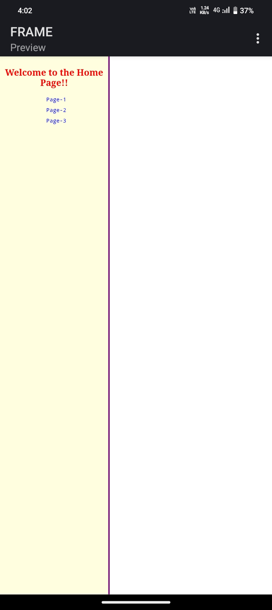
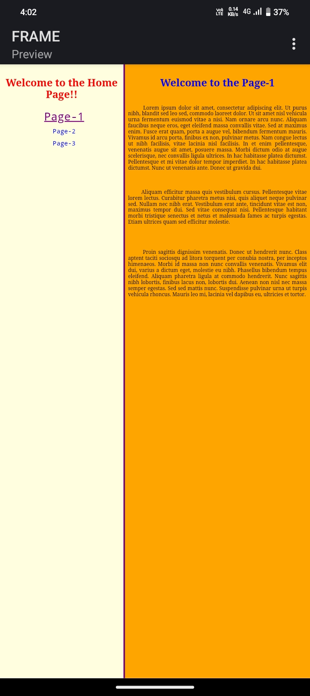
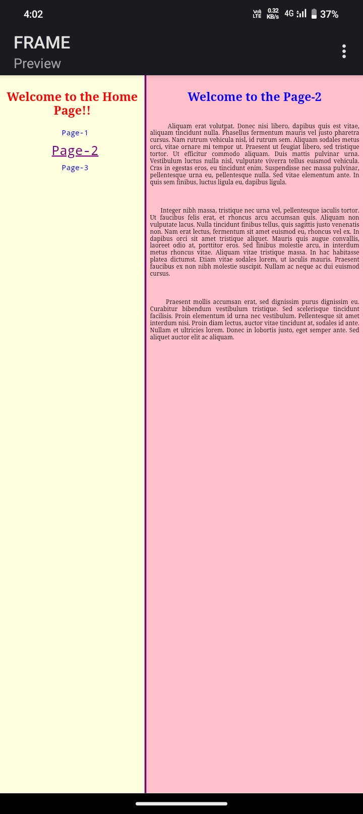
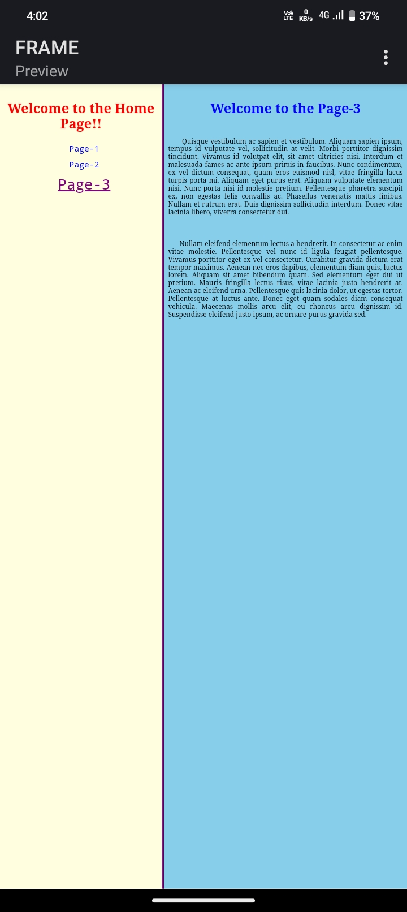

# HTML Frames Navigation Project

## 📄 Project Overview

>This project demonstrates the use of HTML frames to create a simple navigation system. The layout consists of two frames:
>1.Left Frame (F1): Contains the homepage (home.html) with links to:

Pg 1

Pg 2

Pg 3

2.Right Frame (F2): Displays the content of the selected page.

## 🔧 Setup Instructions

1. Clone or download the project folder.

2. Open main.html in your browser.

3. Use the links in the left frame (F1) to navigate. The selected page will load in the right frame (F2).

## 🌐 How It Works

main.html (Main Frame Document)

Defines a <frameset> with two columns:

Left column (F1): Fixed width (e.g., 40%) and loads homeph.html.

Right column (F2): Flexible width and displays content pages (pg1.html, etc.) based on navigation.

<frameset cols="40%,60%">
  <frame src="homepg.html" name="F1">
  <frame src="" name="F2">
</frameset>

homepg.html (Navigation Pane)

Contains hyperlinks targeting the right frame (F2):

<!DOCTYPE html>
<html>
<head>
  <link rel="stylesheet" href="style.css">
</head>
<body>
  <h2>Navigation</h2>
  <ul>
    <li><a href="pg1.html" target="F2">Page 1</a></li>
    <li><a href="pg2.html" target="F2">Page 2</a></li>
    <li><a href="pg3.html" target="F2">Page 3</a></li>
  </ul>
</body>
</html>

pg1.html, pg2.html, pg3.html

Each page contains unique content and links to the shared CSS.

- Example pg.html:

<!DOCTYPE html>
<html>
<head>
  <link rel="stylesheet" href="style.css">
</head>
<body>
  <h4>Page 1 </h4>
  
This is the content of Page 1.

</body>
</html>

style.css

Shared styles across all HTML files.

- Example:

body {
  font-family: Arial, sans-serif;
  background-color: #f9f9f9;
  margin: 10px;
}

h4 {
  color: #333;
}

a {
  text-decoration: none;
  color: blue;
}
a:hover {
  text-decoration: underline;
}

## 📸 Preview 
Frame
 
 
 Page1 Output
 
 
 Page2 Output
 
 
 Page3 Output
 

## 🚨 Note

HTML frames (<frameset> and <frame>) are deprecated in HTML5 and may not work well in modern browsers. For long-term or production projects, consider using iframes or modern single-page app frameworks instead.

# ✅ Author

Created as a simple demonstration of HTML frames and internal navigation.
